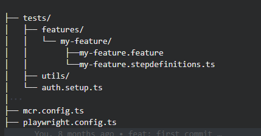

# 🧪 Dojo Playwright & Playwright-BDD

Bienvenue dans ce dojo où vous apprendrez à utiliser Playwright et Playwright-BDD pour automatiser des tests end-to-end sur une application web. Vous mettrez en place une authentification persistante, testerez la connexion à une page sécurisée, la consultation d'un profil utilisateur, le téléchargement d’un dépôt GitHub, et vérifierez l’accessibilité ainsi que la couverture de vos tests.

## 🎯 Objectifs

1. [**Tester la page Duende**]((https://github.com/synnksou/dojo-playwright-bdd/blob/dojo/step-one/README.md)) : Vérifiez la redirection et les messages après une tentative de connexion.
2. [**Configurer l'authentification**]((https://github.com/synnksou/dojo-playwright-bdd/blob/dojo/step-two/README.md)) : Mettez en place une session authentifiée persistante.
3. [**Test du Profil**]((https://github.com/synnksou/dojo-playwright-bdd/blob/dojo/step-three/README.md)) : Vérifiez que les informations de session sont visibles après connexion avec l'utilisation d'un setup.
4. [**Tester le téléchargement du repo**]((https://github.com/synnksou/dojo-playwright-bdd/blob/dojo/step-four/README.md)) : Vérifiez que l’utilisateur peut télécharger le repo GitHub.
5. [**Test d'Accessibilité**]((https://github.com/synnksou/dojo-playwright-bdd/blob/dojo/step-five/README.md)) : Assurez-vous que toutes les images ont un attribut alt.
6. [**Ajouter la couverture de code**]((https://github.com/synnksou/dojo-playwright-bdd/blob/dojo/step-six/README.md)) : Générez un rapport de couverture pour vos tests.

## ✅ Prérequis

- Node.js installé sur votre machine (Node 18).
- Connaissances en JS et TS.

## 🚀 Installation

### 1. Clonez le repo

```bash
git clone https://github.com/synnksou/dojo-playwright-bdd.git
cd dojo-playwright-bdd
```

### 2. Installez les dépendances

Installez les autres dépendances :

```bash
npm install
```

Installez Playwright :

```bash
npx playwright install
```


## Configuration

### 🧩 Playwright et Playwright-BDD

Après avoir installé **Playwright** ainsi que les packages nécessaires à l’utilisation de Playwright-BDD, il est important de configurer correctement l’environnement de test.

#### 📁 Configuration de base avec `defineBddConfig`
Lorsque vous utilisez Playwright-BDD, il faut spécifier où se trouvent vos fichiers `.feature` et leurs fichiers de définition de pas (`.stepdefinitions.ts`). Pour cela, on utilise la fonction `defineBddConfig` dans le fichier `playwright.config.ts` :

```typescript
const testDir = defineBddConfig({
	features: 'tests/features/**/*.feature',
	steps: 'tests/features/**/*.stepdefinitions.ts',
});
```

[Voir la documentation officielle de playwright-bdd](https://vitalets.github.io/playwright-bdd/#/configuration/options)

#### 🛠 Intégration dans la configuration globale `playwright.config.ts`

Une fois votre `testDir` défini, il suffit de l’injecter dans la configuration Playwright principale :

```typescript
export default defineConfig({
    testDir, // Le répertoire défini avec defineBddConfig
    projects: [
        {
            name: 'chromium',
            use: { ...devices['Desktop Chrome'] },
        },
    ],
});
```
[Voir la documentation officielle de Playwright sur la configuration](https://playwright.dev/docs/test-configuration)

Cela permet à Playwright de charger correctement vos scénarios BDD (Gherkin) et leurs étapes associées au moment du lancement des tests.

### 📁 Structure recommandée



#### 📁 `tests/features/`
C’est ici que vous placez tous vos **scénarios BDD** écrits en Gherkin (`.feature`) ainsi que leurs définitions (`.stepdefinitions.ts`).

Exemple :
  * `my-feature.feature` : contient les scénarios de test (Given, When, Then…)
  * `my-feature.stepdefinitions.ts` : contient l’implémentation de ces étapes en TypeScript ou JavaScript via Playwright-BDD

Cette organisation par **feature** permet de regrouper facilement les tests liés à une même fonctionnalité.

#### 📁 `tests/utils/`
Ce dossier est destiné à des outils partagés ou des scripts de préparation, par exemple :
 * `auth.setup.ts` : un fichier servant à créer un contexte d’authentification persistant utilisé dans les tests, par exemple via [`APIRequestContext`](https://playwright.dev/docs/api/class-apirequestcontext) et [`storageState`](https://playwright.dev/docs/api/class-apirequestcontext#api-request-context-storage-state).

Ce fichier peut être lancé via un projet Playwright dédié dans la config (avec la propriété `testMatch`).

### 🧪 Exécution des tests

Pour exécuter les tests localement, utilisez la commande suivante :

```bash
npx playwright test
```

Pour exécuter les tests localement avec l'interface utilisateur, utilisez la commande suivante :

```bash
npx playwright test --ui
```

### Écriture des tests

#### Exemple d'utilisation de Playwright-bdd

Ceci est une explication de comment utiliser Playwright-bdd, ne créez pas de fichier ici.

Pour mettre en place un scénario de test avec Playwright-bdd, suivez les étapes suivantes :
Commencez par ajouter un fichier `.feature` dans le dossier features. Par convention, il est organisé par composant, par exemple : `features/<nomDuComposant>/<nomDuFichier>.feature`.
Ce fichier décrit en langage Gherkin le comportement attendu. Par exemple :

```gherkin
Feature: Gestion du panier

  Scenario: Ajout d'un produit dans le panier
  ...
```
Pour chaque fichier .feature, il faut créer un fichier de définitions d'étapes correspondant dans le même dossier, avec l'extension `.stepdefinitions.ts`. 

Ce fichier associe chaque étape Gherkin à une fonction de test Playwright :

```typescript
import { createBdd } from 'playwright-bdd';

const { Given, When, Then } = createBdd();

Given('...', async ({ page }) => {
  // ...
});

When('...', async ({ page }, title) => {
  // ...
});

Then('...', async ({ page }, title) => {
  // ...
});
```

Une fois vos fichiers .feature et leurs définitions prêtes, vous pouvez lancer les tests avec :

Cette commande génère les fichiers de test compatibles Playwright à partir de vos fichiers .feature et exécute les scénarios définis.
```bash
npx bddgen
```

```bash
npx playwright test
```

Pour plus de simplicité, le projet fournit déjà plusieurs scripts dans le fichier package.json pour simplifier l'exécution des tests :
* `watch:bdd` : génère automatiquement les fichiers Playwright à chaque modification d’un fichier .feature ou .stepdefinitions.
* `watch:pw` : lance l’interface graphique de Playwright pour exécuter et visualiser les tests.
* `watch` : exécute en parallèle watch:bdd et watch:pw pour un flux de travail complet.
  
Vous pouvez donc simplement lancer :

```bash
npm run watch
```

Après avoir compris et installé le nécessaire, vous pouvez passer au premier exercice ! :
### [Passer au prochain exercice !](https://github.com/synnksou/dojo-playwright-bdd/blob/dojo/step-one/README.md)

### Sources

- [Playwright](https://playwright.dev/docs/intro)
- [Playwright-Bdd](https://vitalets.github.io/playwright-bdd/#/)

### 🙏 Remerciements

Un grand merci à **Paul Plancq** ([@pplancq](https://www.github.com/pplancq)) pour son accompagnement et ses retours techniques tout au long de ce dojo/codelab.  
Merci également à **Olivier Sailly** ([@Olisail](https://www.github.com/Olisail)) pour son soutien, ses conseils et son expertise précieuse.

Votre contribution a largement participé à la qualité de ce projet !

### Contribuer

Les contributions sont les bienvenues ! Veuillez ouvrir une issue ou une pull request pour toute suggestion ou amélioration.
    
Bonne chance avec votre dojo ! Si vous avez des questions ou des problèmes, n'hésitez pas à demander.
